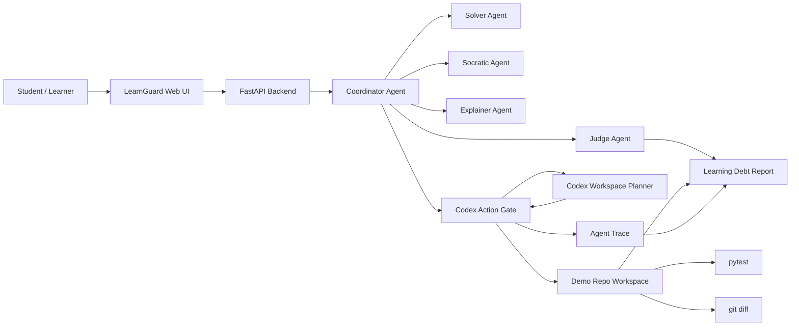
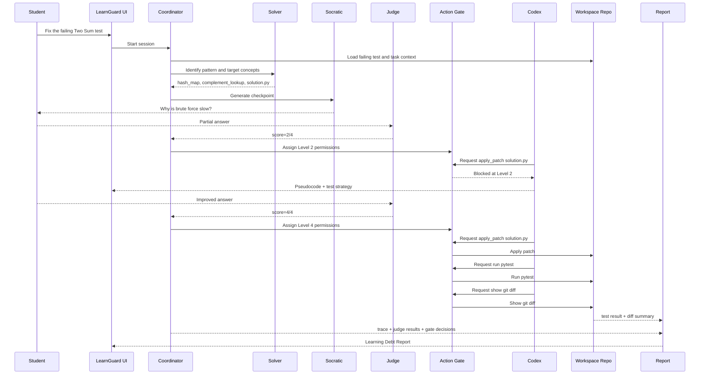
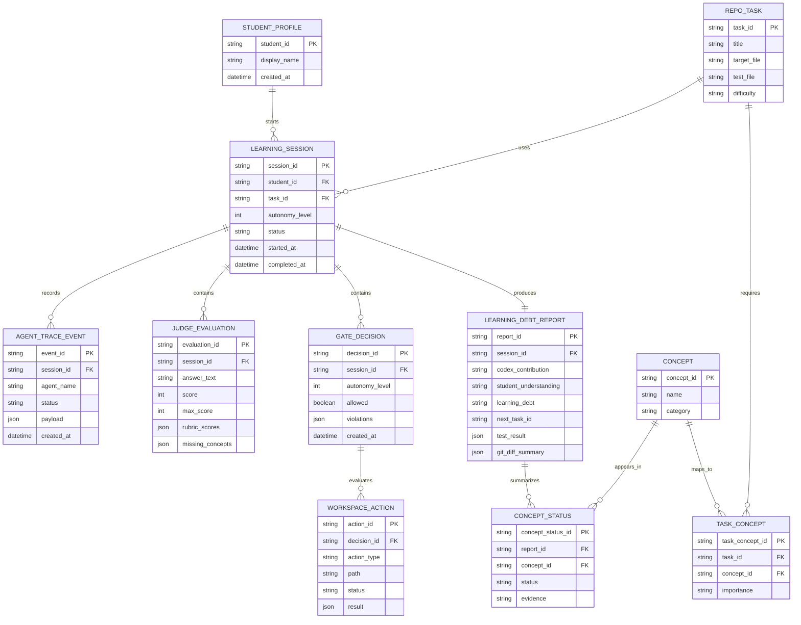

# LearnGuard Architecture

## Architecture Goal

LearnGuard wraps Codex with a learning-aware action gate.

The gate does not only shape model text. It controls whether Codex can perform workspace actions such as reading files, proposing diffs, applying patches, running tests, and showing `git diff`.

## System Context



## Runtime Flow



## Components

| Component | Responsibility |
|---|---|
| Web UI | Shows repo task, checkpoint question, agent trace, gate status, proposed diff, tests, and report. |
| FastAPI Backend | Owns session lifecycle and exposes API routes for session start, answer submission, and report retrieval. |
| Coordinator Agent | Orchestrates Solver, Socratic, Judge, Gate, Codex action planning, Explainer, and report generation. |
| Solver Agent | Reads task context and identifies pattern, concepts, target file, and solution approach. |
| Socratic Agent | Produces one targeted checkpoint question tied to the concept most likely to be outsourced. |
| Judge Agent | Scores the learner answer against rubric items and returns missing concepts plus next action. |
| Codex Action Gate | Enforces permissions before Codex can touch the workspace. |
| Workspace Runner | Executes allowed local actions such as file reads, patch application, `pytest`, and `git diff`. |
| Explainer Agent | Produces a visual trace for the algorithm or patch after the right level is unlocked. |
| Learning Debt Report | Summarizes Codex contribution, learner understanding, blocked actions, verified concepts, weak concepts, tests, diff, and next task. |

## Codex Action Permission Model

| Level | Name | Allowed Actions | Blocked Actions |
|---:|---|---|---|
| 0 | Question Only | `ask_checkpoint` | `list_files`, `read_file`, `write_file`, `run_command`, `show_diff` |
| 1 | Read-Only Orientation | `list_files`, `read_problem`, `read_test`, `name_pattern` | `read_solution`, `write_file`, `run_command`, `show_diff` |
| 2 | Plan + Test Strategy | `read_problem`, `read_test`, `read_solution`, `generate_pseudocode`, `generate_test_plan` | `write_file`, `apply_patch`, `run_command`, `show_diff` |
| 3 | Diff Proposal | `read_file`, `propose_diff`, `explain_diff` | `write_file`, `apply_patch`, `run_command` |
| 4 | Workspace Unlock | `read_file`, `write_file`, `apply_patch`, `run_command`, `show_diff` | None |

## Action Gate Contract

Each Codex workspace request is represented as a structured action:

```json
{
  "type": "apply_patch",
  "path": "solution.py",
  "reason": "Implement one-pass hash map lookup for Two Sum"
}
```

The gate returns a structured decision:

```json
{
  "allowed": false,
  "level": 2,
  "action": {
    "type": "apply_patch",
    "path": "solution.py"
  },
  "violations": [
    "action blocked at level 2: apply_patch"
  ]
}
```

## Logical Data Model

The hackathon version can run in memory or write JSON files. The ERD below describes the persistence-ready model.



## Learning Debt Calculation

The hackathon version should keep this simple and explainable.

```text
Codex contribution:
- Low: Codex only gave hints or pattern names.
- Medium: Codex proposed pseudocode or a diff.
- High: Codex applied a patch and ran tests.

Student demonstrated understanding:
- Low: 0-1 rubric items passed.
- Medium: 2-3 rubric items passed.
- High: 4+ rubric items passed.

Learning Debt:
- Low: Codex contribution is not higher than demonstrated understanding.
- Medium: Codex contribution is one level higher than demonstrated understanding.
- High: Codex contribution is two or more levels higher than demonstrated understanding.
```

## Demo Acceptance Criteria

- The repo starts with a failing `pytest`.
- LearnGuard visibly blocks `apply_patch solution.py` before the learner unlocks enough understanding.
- The agent trace shows Solver, Socratic, Judge, Gate, Codex action request, blocked action, patch, test, and diff.
- The final report includes Learning Debt, verified concepts, weak concepts, blocked actions, `pytest` output, and `git diff` summary.
- The demo can be explained in 2 minutes without requiring a teacher dashboard or persistent database.

