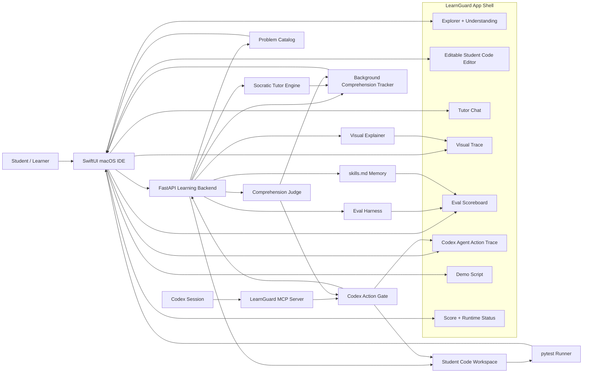
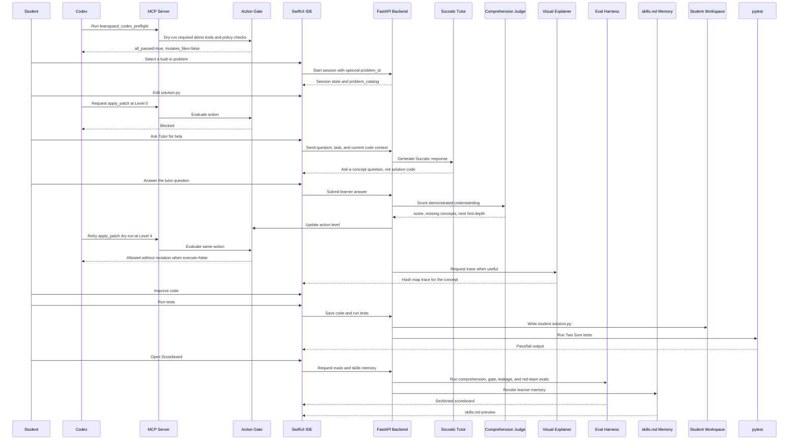
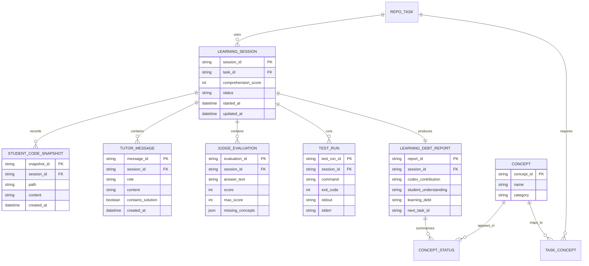

# LearnGuard Architecture

## Architecture Goal

LearnGuard is a Codex-native study-mode runtime with an MCP action gate.

Codex can help inside a real coding workspace, but every stronger workspace action is evaluated against what the learner has proven they understand. The student remains the primary actor, and the SwiftUI app turns the gate trace, evals, and Learning Debt memory into a judge-visible proof surface.

## System Context

## Target Runtime Flow

## Current Branch Flow

The current branch has the learning backend and a SwiftUI study-mode shell with an editable `solution.py` editor, Tutor chat, Visual tab, Scoreboard tab, Script tab, and Run flow.

Current implemented flow:

1. SwiftUI checks FastAPI health.
2. SwiftUI loads the built-in problem catalog.
3. Backend loads the requested built-in demo repo context, defaulting to Two Sum.
4. SwiftUI loads the editable `solution.py` editor from session context.
5. The Codex MCP preflight proves required gate tools are visible and dry-run safe.
6. Level 0 action attempts are blocked by policy before mutation.
7. Student edits code and can ask the Tutor for Socratic guidance with current code context.
8. Tutor returns questions or hints with `contains_solution: false`.
9. Learner answer updates score, level, visual trace, report state, and `skills.md` memory.
10. The same action can be allowed as a Level 4 dry-run after understanding is proven.
11. Student presses Run; SwiftUI saves `solution.py` through `/api/code` and runs pytest through `/api/run`.
12. SwiftUI renders test output, Tutor state, Visual trace, action trace, score, eval scoreboard, demo script, and `skills.md` memory.

## Components

| Component | Responsibility |
|---|---|
| SwiftUI macOS IDE | Primary demo surface. Hosts Explorer, student editor, Tutor, Visual, Scoreboard, Script, and status bar. |
| Explorer + Understanding | Shows task files and tracked concepts. Keeps the student oriented. |
| Student Code Editor | Target editable surface for `solution.py`. The student owns the implementation. |
| Tutor Chat | Codex-backed Socratic tutor. Asks questions and gives hints without full solution code. |
| Visual Explainer | Shows concrete algorithm traces such as Two Sum hash map state. |
| Scoreboard | Shows sectioned eval proof for comprehension scoring, gate policy, leakage prevention, and red-team resistance. |
| Codex Agent Action Trace | Shows live gate evidence: MCP preflight, blocked action, unlocked action, eval proof, and skills memory state. |
| Demo Script | Keeps the fast caption recording path inside the primary SwiftUI app. |
| FastAPI Backend | Owns session state, task context, scoring, tutor responses, visual traces, evals, memory, and test execution. |
| Problem Catalog | Provides local built-in tasks for repeatable onboarding and smoke rehearsal. |
| Comprehension Judge | Scores learner answers and identifies missing concepts. |
| Codex Action Gate | Enforces workspace permissions before Codex can read, patch, run commands, or expose diffs. |
| MCP Server | Local Codex integration surface for preflight, judge, gate, and execute dry-runs. |
| Background Tracker | Maintains score, concepts, hint depth, and Learning Debt state. |
| skills.md Memory | Renders demonstrated understanding, weak concepts, Learning Debt trend, and next task as markdown. |
| Student Workspace | Holds the demo repo files used by the student editor and test runner. |
| pytest Runner | Runs tests against the student's code and returns output. |
| Web Fallback | Existing browser demo retained as a fallback surface, not the primary product UI. |

## Source Boundaries

Only this `LearnGuard/` directory is the product repository. Adjacent hackathon folders are evidence or design sources:

| Path | Boundary |
|---|---|
| `../style/` | Design prototype/reference. It can inform SwiftUI polish, but it is not runtime source and is not copied or moved into this repo for the current branch. |
| `../test/` | Separate historical git repo. It should not be staged, merged, or treated as part of this product repo. Any dirty files there are outside this branch. |
| `../OpenAI Codex Hackathon - Sydney · Luma.pdf` | Event rules and submission requirements source. |
| `../openai_codex_hackathon_winning_projects.xlsx` | Research source for judging patterns and positioning. |

## API Surface

Current API:

| Endpoint | Purpose |
|---|---|
| `GET /health` | Check backend availability. |
| `POST /api/session` | Start an isolated learning session. It defaults to Two Sum, accepts optional `problem_id`, and returns `problem_catalog`. |
| `GET /api/problems` | Return public metadata for the built-in problem catalog. |
| `GET /api/sessions` | List persisted local session summaries for history and replay. |
| `GET /api/session/{session_id}` | Read current session state. |
| `POST /api/answer` | Submit learner answer and receive score, hint, report, and visual trace state. |
| `GET /api/evals` | Return flat legacy cases plus sectioned Comprehension, Gate Policy, Leakage, and Red-team eval results with judge mode metadata. |
| `GET /api/redteam` | Return focused red-team gate policy results. |
| `GET /api/skills` | Return generated learner memory artifact, markdown, and structured summary. |
| `GET /api/skills.md` | Return generated learner memory markdown as `text/markdown`. |

Student editor API contract:

| Endpoint | Purpose |
|---|---|
| `POST /api/code` | Save the student's current `solution.py`. |
| `POST /api/run` | Run tests against the student's current code. |
| `POST /api/tutor` | Ask the Tutor using the task, current code, and learner message. |

The code endpoint accepts only session-scoped student files, starting with `solution.py`. Invalid paths are rejected before touching the workspace.

The run endpoint executes pytest against the saved student code and returns pass/fail output. It validates the student's work; it does not apply a Codex patch.

The answer endpoint scores understanding and may update score, hint depth, trace state, and report state. It must not persist code into the student workspace; `POST /api/code` is the only API that saves `solution.py`.

The tutor endpoint returns Socratic guidance with `contains_solution: false`. It may ask a question, point to a misconception, or suggest a trace, but it must not return a full solution implementation.

All three endpoints return `{"detail": "session not found"}` for missing sessions.

MCP stdio exposes the same policy concepts for local Codex rehearsal. `learnguard_codex_preflight` proves the required demo tools are visible and dry-run safe. `learnguard_judge_answer` accepts an optional `problem_id`, and the gate/execute tools accept `problem_id` so the demo can prove policy behavior on built-in problems beyond Two Sum.

## Codex Action Permission Model

| Level | Name | Allowed Actions | Blocked Actions |
|---:|---|---|---|
| 0 | Question Only | `ask_checkpoint` | `list_files`, `read_file`, `write_file`, `apply_patch`, `run_command`, `show_diff` |
| 1 | Read-Only Orientation | `list_files`, `read_problem`, `read_test`, `name_pattern` | `read_solution`, `write_file`, `apply_patch`, `run_command`, `show_diff` |
| 2 | Plan + Test Strategy | `read_problem`, `read_test`, `read_solution`, `generate_pseudocode`, `generate_test_plan` | `write_file`, `apply_patch`, `run_command`, `show_diff` |
| 3 | Diff Proposal | `read_file`, `propose_diff`, `explain_diff` | `write_file`, `apply_patch`, `run_command` |
| 4 | Workspace Unlock | `read_file`, `write_file`, `apply_patch`, `run_command`, `show_diff` | None |

## Smoke Proof Boundary

Automated smoke is the HTTP script in `scripts/smoke_demo.py`. It proves the backend contract against a running FastAPI server and restores `demo_repo/solution.py` to the exact content present before the smoke run.

Manual native smoke is separate. It verifies the SwiftUI macOS app behavior by inspection: offline state, health check, Start Session, editable code, Tutor, Visual trace, Run, Scoreboard, Script, score, `skills.md`, and Learning Debt rendering. The manual smoke does not replace the automated API and HTTP smoke checks.

## Tutor And Scoring Policy

The Tutor is allowed to:

- ask questions
- provide hints
- identify misconceptions
- request a trace
- explain a concept in plain language

The Tutor is not allowed to:

- paste a full implementation
- apply a patch for the student
- turn the interaction into answer copying

The comprehension tracker controls hint depth. It can surface a score or level in the status bar, but it should stay in the background of the product story.

## Data Model

The hackathon version can stay in memory. The persistence-ready model is:

## Demo Acceptance Criteria

- The product can be explained as "Codex as a gated teacher, not an unearned coder."
- The primary UI shows a student editor, Tutor tab, and Visual tab.
- The Scoreboard shows comprehension, gate policy, leakage, and red-team proof.
- The Codex Agent Action Trace shows blocked and allowed workspace actions.
- The Script tab supports a fast caption path that fits inside the strict two-minute video limit.
- The student remains responsible for the code.
- The Tutor never gives a full solution.
- The Visual trace explains the algorithm concept.
- Test output validates the student's code.
- Score and Learning Debt exist as background feedback, with `skills.md` as the visible learner memory artifact.

## Production Architecture Extensions

The hackathon architecture is intentionally local-first and in-memory. A production LearnGuard platform would add these components without changing the core student-first action-gate model:

| Component | Production responsibility |
|---|---|
| Auth service | Own learner identity, roles, and session access. |
| Session database | Persist learner progress, code snapshots, tutor messages, test runs, and reports. |
| Problem catalog | Manage multiple tasks, curricula, rubrics, fixtures, and concept maps. |
| Sandbox runner | Execute untrusted student code in an isolated environment with time, file, and network limits. |
| Codex tutor orchestrator | Route task context, code context, policy constraints, and hint depth into adaptive tutor calls. |
| Policy monitor | Detect and block full-solution leakage or unsafe workspace actions. |
| Evaluation history store | Track understanding over time across tasks and concepts. |
| Instructor dashboard | Let teachers review attempts, learning debt, hint usage, and test history. |
| Audit and privacy layer | Record execution and tutor events while enforcing retention and learner-data controls. |

Production flow would replace the local demo workspace with a scoped workspace service, replace in-memory sessions with durable storage, and run student code in a sandbox. The Tutor would remain constrained: Codex teaches through questions, hints, and visual explanation instead of producing final solution code.
